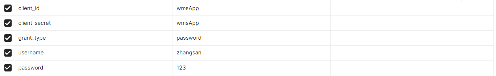
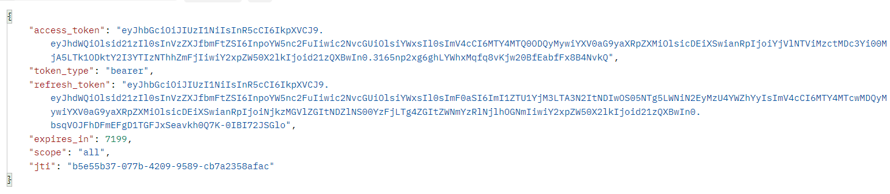
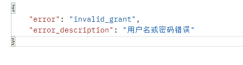
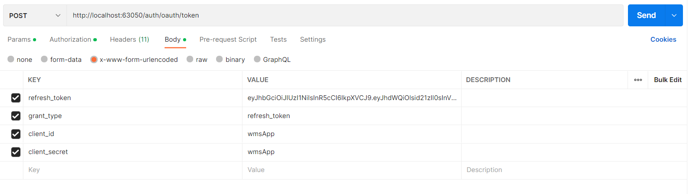
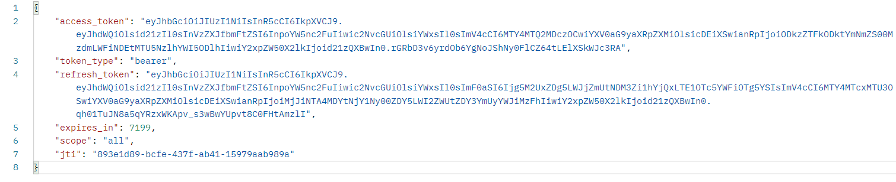
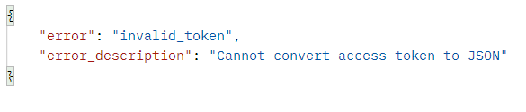
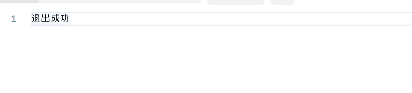

# 接口文档

**简介**:Api Documentation

**HOST**:117.50.181.29:63050（后期会修改成网关地址）

**联系人**:

**Version**:1.0

**接口路径**:/v2/api-docs

# 登录及令牌刷新

## 登录请求

> 登录成功会返回前端access_token和refresh_token，前端需要在后续请求中将access_token放在请求头中，格式为Authorization:Bearer {access_token}，而refresh_token用于刷新令牌，前端需要进行保存，后续会使用。

**接口地址**:`/auth/oauth/token`

**请求方式**:`POST`

**请求数据类型**:`application/x-www-form-urlencoded`

**响应数据类型**:`*/*`

**接口描述**:

**请求参数**:

**响应状态**:

| 状态码 | 说明           | schema            |
| --- | ------------ | ----------------- |
| 200 | OK           | OAuth2AccessToken |
| 401 | Unauthorized |                   |
| 403 | Forbidden    |                   |
| 404 | Not Found    |                   |

**响应参数**:

**登录成功**：

**登录失败**：

## 刷新令牌:

> token过期时后端会返回token过期的异常，前端需要发送此请求去后端中拿到新的token

接口地址**:`/auth/oauth/token`

**请求方式**:`POST`

**请求数据类型**:`application/x-www-form-urlencoded`

**响应数据类型**:`*/*`

**接口描述**:

**请求参数**:

**返回结果:**

## 退出登录
**接口地址**:`/auth/logout`

**请求方式**:`POST`

**请求数据类型**:`application/x-www-form-urlencoded`

**响应数据类型**:`json`

**接口描述**: 用户退出并清空对应的redis缓存

**请求参数**：无

**响应结果**：

